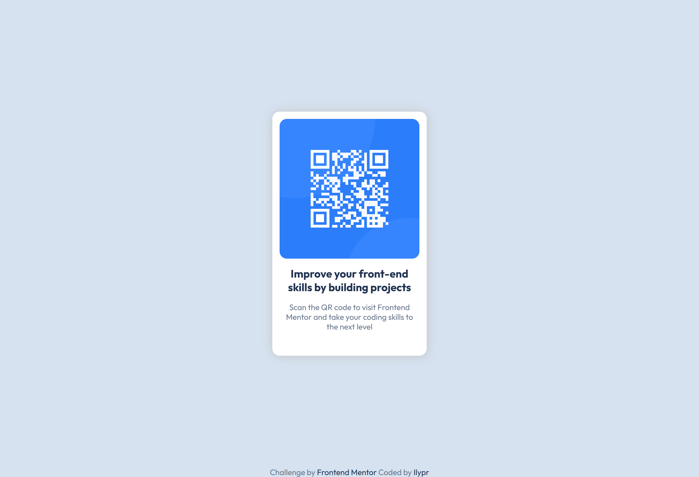

# Frontend Mentor - QR code component solution

This is a solution to the [QR code component challenge on Frontend Mentor](https://www.frontendmentor.io/challenges/qr-code-component-iux_sIO_H).

## Table of contents

- [Overview](#overview)
  - [Screenshot](#screenshots)
  - [Links](#links)
- [My process](#my-process)
  - [Built with](#built-with)
  - [What I learned](#what-i-learned)

## Overview

The main goal of this project was to build a QR code component and get it looking as close as the original reference, using provided style-guide.md file.

### Screenshots
<p style="text-align:center;">Pc and mobile versions of the webpage</p>
<div style="text-align:center;">
  
  
</div>

### Links

- Solution URL: [Add solution URL here](https://your-solution-url.com)
- Live Site URL: [Add live site URL here](https://your-live-site-url.com)

## My process

### Built with

- Semantic HTML5 markup
- CSS custom properties
- Flexbox
- Mobile-first workflow

### What I learned

With this project i've learned how to properly position an object using flexbox, as well as giving right class names.
Also, throughout the project, i've learnt one of the methods on how to make flexable footer that'd stick to the bottom of the screen, even if I'd add additional content that'd take a chunk of free space. (the footer part can be removed if needed)
I discovered an information, that u can remove standard css style by creating a pseudo class name, and setting both values of margin and paddaing to 0.

```html
<h1>Some HTML code I'm proud of</h1>
```

```css
/* pseudo-license position (so It'd stick to the bottom of the webage) */
main {
  flex-grow: 1;
}

* {
  margin: 0;
  padding: 0;
}
```
